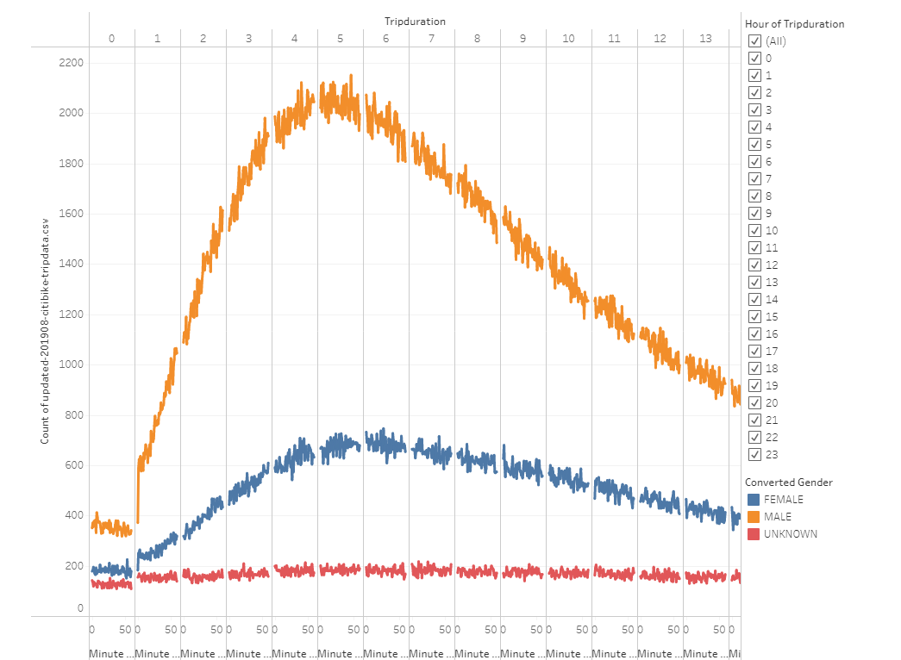

# bikesharing

## Purpose
The objective is to use NY Citi Bike data from August of 2019 to determine bike-sharing viability in city of Des Moines using our data visualization tool, Tableau Public.

## Results
### Our Story
[Link to the Tableau Dashboard](https://public.tableau.com/app/profile/daniel.chu6199/viz/BikeSharingforDesMoines/NYCCitiBike?publish=yes).

### Our Report
There are several general information to share before we dive into our analysis.

- There were more than 2.3 million riders in the month of August in 2019.
- User types are dominantly subscriptions based, approximately 80%, which is awesome.
- The dotted heatmap shows the starting locations where bikes are rented. In this case, the map presents the wide usage of the service throughout mainly Mid to Lower Manhattan. It is likely due to the financial district/office buildings and tourism in the area.

- This graph displays the checkout times for the bikes.
- The graph shows that bikes are more often checked out between 3 to 7 hours.

- Similar to the previous graph, however, this shows use the gender distribution of our users.
- Our bikes are dominantly checked out by male users comparing to female users. 

- This chart shows the peak hours the bikes are rented.
- This may be the fact that people travel to and from work during the hours of 7AM-9AM and 4PM to 7PM.
- 

- This is the heatmap of bike usages to the corresponding times and separated by genders
- We can see here again the most active hours between the times of 7AM-9AM and 4PM to 7PM from the color density.

- Lastly, we have the bike usages filtered by the days of the week and again separated by gender.
- The bikes are very commonly used during the weekdays and less on Sunday. May be due to the fact that the service has more impact for people that commutes to work in the city. 

### Summary
Our visualizations presents very high bike sharing activities during August of 2019 in Manhattan, New York. It is likely due to the financial district and where majority of people work and travel. From our Customer Type chart, we can speculate that 'subscribers' are locals who works and so are highly active in the area and 'customers' may be tourists or outliers. 

From the various charts and graphs, this shows that bike sharing service impacts city life positively. Majority of the users are subscribers, which can mean people require and rely on this service in the city on top of the city with major public trasportaions (subways, buses, etc). 

#### Further analysis needed
We need to consider the population between the city of NY and Des Moines for another team to analysis the likelihood of the service being popular to the people in Des Moines.

#### Suggestions

- We need to create a visualization for off peak hours to determine the best times our team to provide maintenances on the bikes. Suggested bike maintenance to be covered between the hours of 1am to 5am according to the peak hours chart

- We should definately compare data from other months/years to confirm the validity of our analysis and how seasons/weathers can contribute to our data.

